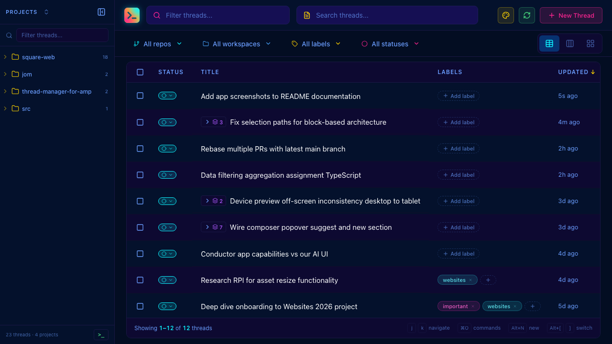
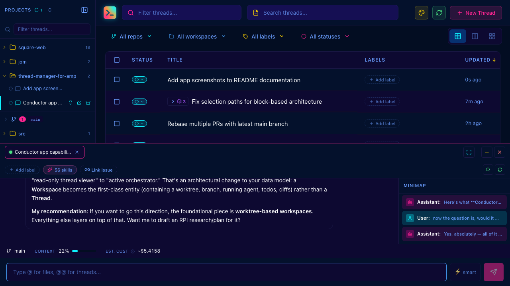
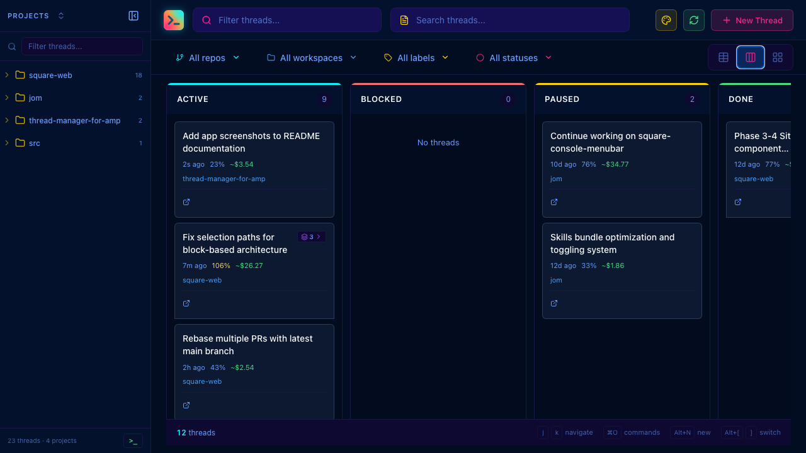

# Thread Manager for Amp

A local web UI for managing [Amp](https://ampcode.com) AI coding agent threads — monitor, interact with, and organize multiple concurrent agent sessions from your browser.

## Screenshots

### Thread List

Sortable, filterable table view with bulk operations, labels, and status tracking.



### Thread Detail

Conversation view with rich message rendering, syntax highlighting, and a minimap for navigation.



### Kanban Board

Organize threads across status columns — Active, Blocked, Paused, and Done.



## Quick Start

### Prerequisites

- **Node.js** 24+ (needed to compile native modules like `better-sqlite3` and `node-pty`)
- **pnpm** 10+ — install with `npm install -g pnpm`
- **[Amp CLI](https://ampcode.com)** installed and authenticated (`amp` command available)

### Install & Run

```bash
pnpm install
pnpm dev
```

Open http://localhost:5173

## Why?

When working with multiple Amp threads simultaneously — across repos, features, and tasks — it's hard to keep track of what's running, what's blocked, and what each thread has done. This tool gives you a single dashboard to manage it all.

## Features

### 🖥️ Multi-Terminal Management

- Run multiple Amp threads side-by-side with tabs, split views, and grid layouts
- Real-time streaming of agent output via WebSocket
- Rich message rendering with syntax highlighting for code and tool outputs
- Conversation minimap for navigating long threads
- Auto-reconnect on connection drops with output resumption

### 📋 Thread Organization

- **Table view** — sortable, filterable thread listing with bulk operations
- **Card view** — detailed cards grouped by date
- **Kanban view** — organize threads across status columns (Active, Blocked, Paused, Done)
- Thread status tracking with blocker relationships between threads
- Labels and linked issue URLs for organization
- Handoff support to create continuation threads

### 🔍 Discovery & Context

- **Thread chains** — visualize parent/child handoff relationships
- **Related threads** — find threads that touched the same files
- **Git activity** — see commits, branches, and PRs correlated to each thread
- **Source control** — view uncommitted changes per workspace with inline diffs
- **Content search** — full-text search across all thread messages

### 🛠️ Built-in Tools

- **Shell terminal** — integrated xterm.js terminal sessions
- **Command palette** (`⌘O`) — quick access to all actions
- **Skills management** — list, add, and remove Amp skills
- **MCP status** — view connected MCP servers
- **Image viewer** — view images attached to or generated by threads

### 🎨 Customization

- **30+ theme presets** — Cyberpunk 2077, Dracula, Tokyo Night, Nord, Catppuccin, Gruvbox, and more
- Adaptive theme system that derives a full UI from just 3 colors (bg, fg, accent)
- Light and dark themes supported
- Configurable layouts and view preferences
- Notification sounds for completed tasks

## Architecture

```
┌─────────────────────────────────────────────────────────┐
│                    Frontend (React 19)                   │
│  src/                                                    │
│  ├── components/     # UI components                     │
│  │   ├── terminal/   # WebSocket terminal + messages     │
│  │   ├── ThreadList/ # Table view with bulk selection    │
│  │   ├── sidebar/    # Workspace tree navigation         │
│  │   └── Toolbar/    # Search, filters, view switching   │
│  ├── hooks/          # Data fetching + state hooks       │
│  ├── commands/       # Command palette registry          │
│  └── lib/            # Theme system, utilities           │
└─────────────────────────────────────────────────────────┘
                           │
┌─────────────────────────────────────────────────────────┐
│               Shared (shared/)                           │
│  types.ts, websocket.ts, validation.ts, cost.ts,         │
│  utils.ts, constants.ts                                  │
└─────────────────────────────────────────────────────────┘
                           │
                    HTTP + WebSocket
                           │
┌─────────────────────────────────────────────────────────┐
│                 Backend (Node.js)                        │
│  server/                                                 │
│  ├── websocket.ts    # Per-thread session management     │
│  ├── shell-websocket.ts  # Shell terminal PTY sessions   │
│  ├── routes/         # REST API handlers                 │
│  │   ├── threads.ts  # Thread CRUD + search + discovery  │
│  │   ├── metadata.ts # Status, labels, blockers          │
│  │   ├── git.ts      # Git status + diffs                │
│  │   ├── skills.ts   # Amp skills + MCP management       │
│  │   └── artifacts.ts # Notes + image storage            │
│  └── lib/            # Core logic                        │
│      ├── threadCrud.ts    # Thread CRUD operations        │
│      ├── threadSearch.ts  # Search + related threads      │
│      ├── threadExport.ts  # Markdown + image export       │
│      ├── threadChain.ts   # Handoff chains                │
│      ├── database.ts # SQLite for local metadata         │
│      ├── amp-api.ts  # Amp internal API client           │
│      ├── git.ts      # Git operations                    │
│      └── git-activity.ts  # Commit/branch correlation    │
└─────────────────────────────────────────────────────────┘
                           │
              ┌────────────┴────────────┐
              │                         │
     ~/.local/share/amp/        ~/.amp-thread-manager/
     └── threads/*.json         ├── threads.db (SQLite)
         (Amp thread data)      └── artifacts/
```

## Data Storage

| Location                           | Purpose                                          |
| ---------------------------------- | ------------------------------------------------ |
| `~/.local/share/amp/threads/`      | Amp's thread JSON files (read by the server)     |
| `~/.amp-thread-manager/threads.db` | Local SQLite for status, blockers, linked issues |
| `~/.amp-thread-manager/artifacts/` | Saved images and notes per thread                |

## Keyboard Shortcuts

| Shortcut          | Action                           |
| ----------------- | -------------------------------- |
| `Ctrl/⌘+O`        | Command palette                  |
| `Alt+N`           | New thread                       |
| `Ctrl/⌘+R`        | Refresh threads / prompt history |
| `Ctrl/⌘+W`        | Close current thread             |
| `Ctrl/⌘+B`        | Toggle sidebar                   |
| `Ctrl/⌘+H`        | Handoff current thread           |
| `Ctrl+T`          | Open shell terminal              |
| `Ctrl+M`          | Thread map                       |
| `Alt+D`           | Toggle deep mode                 |
| `Alt+L`           | Toggle layout                    |
| `Alt+[` / `Alt+]` | Switch tabs                      |
| `j/k` or `↓/↑`    | Navigate thread list             |
| `Enter`           | Open focused thread              |
| `x`               | Toggle selection                 |
| `Esc`             | Close modal / clear focus        |

## Scripts

| Command           | Description                                     |
| ----------------- | ----------------------------------------------- |
| `pnpm dev`        | Start dev server (Vite frontend + Node backend) |
| `pnpm build`      | Build for production                            |
| `pnpm start`      | Build and serve production                      |
| `pnpm check`      | Format check + lint + typecheck + build         |
| `pnpm lint`       | ESLint                                          |
| `pnpm typecheck`  | TypeScript type check                           |
| `pnpm test`       | Run tests (Vitest)                              |
| `pnpm test:watch` | Run tests in watch mode                         |

## Configuration

| Environment Variable | Default       | Description                  |
| -------------------- | ------------- | ---------------------------- |
| `PORT`               | `3001`        | Backend server port          |
| `AMP_HOME`           | `$HOME`       | Base directory for Amp data  |
| `AMP_BIN`            | auto-detected | Path to the `amp` CLI binary |

## Security

This is a **local development tool**. The server binds to `localhost` only and is not accessible from other devices. See [SECURITY.md](SECURITY.md) for details.

## Troubleshooting

### Native module build errors (`better-sqlite3`, `node-pty`)

These packages require compilation. Make sure you have:

- **macOS**: Xcode Command Line Tools (`xcode-select --install`)
- **Linux**: `build-essential`, `python3`
- Node.js 24+ (check with `node -v`)

If builds fail, try: `pnpm rebuild`

### "Amp CLI not found"

Make sure `amp` is in your PATH, or set `AMP_BIN` to the full path of the binary.

### Port already in use

Set a different port: `PORT=3002 pnpm dev`

## Tech Stack

- **Frontend**: React 19, TypeScript, Vite
- **Backend**: Node.js with raw `http` module (no Express)
- **Database**: SQLite via better-sqlite3
- **WebSocket**: `ws` for real-time agent streaming
- **Terminal**: xterm.js + node-pty for shell sessions
- **Testing**: Vitest, Testing Library
- **Styling**: CSS custom properties (no UI framework)

## License

[Apache License 2.0](LICENSE)
